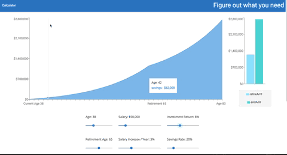

[](https://github.com/gabrielwr/React-Retirement-Calculator/issues)
[](https://github.com/gabrielwr/React-Retirement-Calculator/pulls?q=is%3Apr+is%3Aclosed)

# React Retirement Calculator

Deployed link here: https://dynamic-retirement.herokuapp.com/ (give Heroku a bit to wake up!)


React Retirement Calculator is a front end application using recharts.js to provide a dynamically updating graph and user experience.

### Demo


## Table of Contents

* [Background](#background)
* [Install](#install)
* [License](#license)


## Background

React Retirement Calculator is a fun side project that I worked on while working at Fullstack Academy as a teaching fellow and software engineer.

I originally conceived of the idea for this calculator after a chapter of learning about personal finance. During that time, I had a favorite retirement calculator that just disappeared from the internet one day. So I figured I would try to recreate it and even improve upon it (since it was probably made in the early 2000's...)

This project is an updated version of a calculator I originally made in vanilla JS, HTML, and CSS.

The basic premise of this calculator is to show the power of compounding interest over time. This calculator has been a great asset for me when I need a little help with remembering to save money ;).

## Install

To install and locally run RRC clone or download the project to your machine and run the following commands:

Install all project dependencies:
```bash
$ npm install
```
To start the server and have webpack build your bundle.js:
```bash
$ npm start
```
## License
MIT (c) Gabriel Rowe

